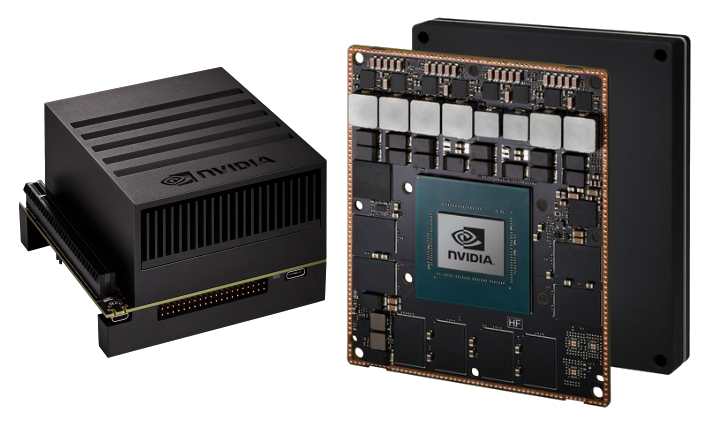
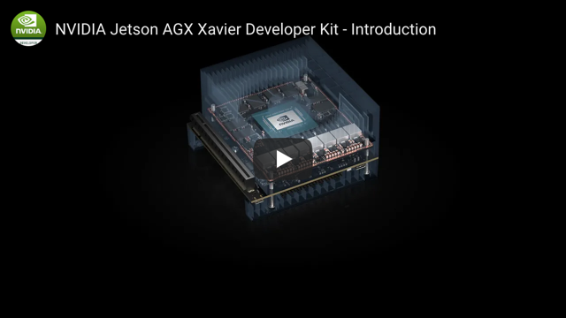

# Hello Xavier
NVIDIA Jetson AGX Xavier embedded compute module with Thermal Transfer Plate (TTP) as follow, only 100x87mm. Jetson AGX Xavier Developer Kit, including Jetson AGX Xavier module and reference carrier board. 

  

The Jetson AGX Xavier is a newly released SoM by NVIDIA. Introduced in 2018, the Xavier can achieve 20 times the performance and 10 times the energy efficiency of its predecesor, the Jetson TX2. Among others, the SoM includes:

- Volta GPU with 512 cores
- 8-core ARM v8.2 CPU
- 16 GB LDDR4
- 2 NVDLA Deep Learning Accelerators
- 2 4Kp60 video codecs
- [Much, much more!](https://nvidia-xavier.readthedocs.io/en/latest/introduction.html)

The following video from NVIDIA provides a nice overview of the Jetson AGX Xavier.  

[](https://www.youtube.com/watch?time_continue=6&v=XoWW5HiGHsg)

```eval_rst

.. toctree::
   :maxdepth: 2
   

```


